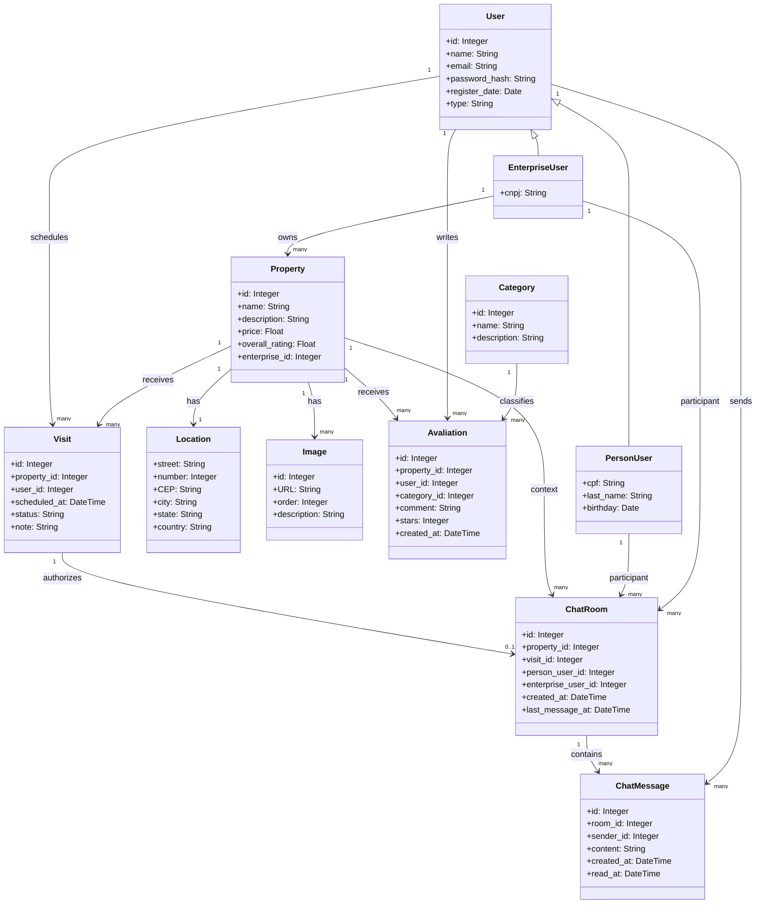

# 🏢 Glassroof Imobiliário

> Um sistema de avaliações transparente para o mercado imobiliário. Saiba o que as pessoas falaram sobre seu próximo lar antes de assinar o contrato.

## 📖 Sobre o Projeto

O **Glassroof Imobiliário** é uma plataforma colaborativa focada no mercado de imóveis. O sistema permite que imobiliárias cadastrem seus portfólios, enquanto usuários podem:

- visualizar imóveis e seus detalhes;
- avaliar imóveis por categoria;
- agendar visitas;
- iniciar conversas em tempo real com a empresa responsável pelo imóvel, quando existe uma visita vinculada.

O objetivo é democratizar o acesso à informação real sobre os imóveis, ajudando futuros moradores a tomarem decisões mais seguras e embasadas.

## 🚀 Tecnologias Utilizadas (Stack)

O projeto foi desenvolvido utilizando uma arquitetura moderna baseada em componentes no Front-end e uma API orientada a serviços no Back-end.

**Front-end:**
* **React.js**: Biblioteca principal para construção da interface.
* **React Router**: Gerenciamento de rotas e navegação SPA (Single Page Application).
* **Tailwind CSS**: Estilização da interface.
* **Socket.IO Client**: Comunicação em tempo real para o chat.

**Back-end:**
* **Python**: Linguagem principal.
* **Flask**: Microframework web para a construção da API.
* **Flask-SocketIO**: Comunicação em tempo real para o módulo de chat.
* **SQLAlchemy**: ORM para comunicação com o banco de dados.
* **PyJWT**: Autenticação baseada em token.
* **Pytest / Unittest**: Framework para garantia de qualidade através de testes unitários e de integração.

**Banco de Dados:**
* **MySQL**: Banco de dados relacional.

## 📂 Arquitetura e Disposição de Pastas

O repositório está dividido em duas aplicações principais (Monorepo). O back-end utiliza uma arquitetura em camadas (`Routes` -> `Services` -> `Models`), garantindo o isolamento da regra de negócio.

```text
glassroof-imobiliario/
├── backend/                  # API Flask
│   ├── app/
│   │   ├── __init__.py       # Factory da aplicação Flask + Socket.IO
│   │   ├── config.py         # Variáveis de ambiente e configurações do BD
│   │   ├── models/           # Modelos do SQLAlchemy (User, Property, Visit, Chat, etc.)
│   │   ├── routes/           # Endpoints HTTP
│   │   ├── services/         # Regras de negócio puras
│   │   └── socket_events.py  # Eventos Socket.IO do chat
│   ├── tests/                # Suíte de testes unitários e de integração
│   ├── requirements.txt      # Dependências do Python
│   ├── run.py                # Ponto de entrada do servidor Flask + Socket.IO
│   └── seed_db.py            # Seed que recria o schema e popula dados iniciais
│
├── frontend/                 # Aplicação React
│   ├── public/               # Arquivos estáticos
│   ├── src/
│   │   ├── assets/           # Imagens e ícones
│   │   ├── components/       # Componentes de UI reutilizáveis
│   │   ├── contexts/         # Estado global de autenticação e notificações
│   │   ├── pages/            # Páginas mapeadas nas rotas
│   │   ├── routes/           # Configuração do React Router
│   │   ├── services/         # Integração com a API Flask e Socket.IO
│   │   ├── App.jsx           # Componente raiz
│   │   └── main.jsx          # Ponto de montagem do React
│   └── package.json          # Dependências do Node/React
│
└── README.md                 # Documentação do projeto
```

## 🏗️ Arquitetura do Sistema

### Estilo Arquitetural

O **Glassroof** adota uma **arquitetura em camadas (Layered Architecture)** combinada com princípios de **separação de responsabilidades**. Essa abordagem permite:

- **Escalabilidade horizontal**: Fácil adição de novos serviços
- **Testabilidade**: Componentes isolados e independentes
- **Manutenibilidade**: Código organizado em camadas bem definidas
- **Flexibilidade**: Fácil substituição de componentes

---

### Diagrama C4 - Nível 1: Contexto do Sistema

```
┌──────────────────────────────────────────────────────────────┐
│                     Glassroof System                         │
├──────────────────────────────────────────────────────────────┤
│                                                              │
│  ┌──────────────┐               HTTP/REST + Socket           │
│  │              │◄──────────────────────────────────────►    │
│  │  Usuário     │                    React Frontend          │
│  │   (Browser)  │                    (SPA)                  │
│  └──────────────┘                                             │
│                                              │               │
│                                              ▼               │
│                                      ┌──────────────────┐    │
│                                      │ Flask API        │    │
│                                      │ + Socket.IO      │    │
│                                      └──────────────────┘    │
│                                              │               │
│                                              ▼               │
│                                      ┌──────────────────┐    │
│                                      │ MySQL Database   │    │
│                                      │ (Relacional)     │    │
│                                      └──────────────────┘    │
│                                                              │
└──────────────────────────────────────────────────────────────┘
```

---

### Diagrama C4 - Nível 2: Containers

```
┌────────────────────────────────────────────────────────────────────────────┐
│                        Glassroof Application                               │
├────────────────────────────────────────────────────────────────────────────┤
│                                                                            │
│  ┌─────────────────────────────────┐          ┌────────────────────────┐   │
│  │   React Frontend (SPA)          │          │   Browser / Node.js    │   │
│  │  ┌──────────────────────────────┤          │                        │   │
│  │  │ • Home Page                  │          │ • React 19             │   │
│  │  │ • Property Search & Filter   │          │ • React Router         │   │
│  │  │ • Property Details           │          │ • Tailwind CSS         │   │
│  │  │ • Reviews Management         │          │ • Socket.IO Client     │   │
│  │  │ • User Authentication        │          │                        │   │
│  │  │ • Visit Scheduling           │          │                        │   │
│  │  │ • Real-time Chat             │          │                        │   │
│  │  └──────────────────────────────┤          │                        │   │
│  │            │                    │          │                        │   │
│  │            │ HTTP/JSON + Socket │          │                        │   │
│  │            ▼                    │          │                        │   │
│  └─────────────────────────────────┘          └────────────────────────┘   │
│            │                                                               │
│            ▼                                                               │
│  ┌─────────────────────────────────┐           ┌────────────────────────┐  │
│  │   Flask API (Python)            │           │   Python 3.10+         │  │
│  │  ┌──────────────────────────────┤           │                        │  │
│  │  │ • Routes & Controllers       │           │ • Flask 3.x           │  │
│  │  │ • Auth Service               │           │ • SQLAlchemy ORM      │  │
│  │  │ • Property Service           │           │ • Flask-SocketIO      │  │
│  │  │ • Avaliation Service         │           │ • PyJWT               │  │
│  │  │ • User Service               │           │ • Pytest / Unittest   │  │
│  │  │ • Visit Service              │           │ • CORS Support        │  │
│  │  │ • Chat Service               │           │                        │  │
│  │  └──────────────────────────────┤           │                        │  │
│  │            │                    │           │                        │  │
│  │            ▼                    │           │                        │  │
│  └─────────────────────────────────┘           └────────────────────────┘  │
│            │                                                               │
│            ▼                                                               │
│  ┌─────────────────────────────────┐          ┌────────────────────────┐   │
│  │   MySQL Database                │          │   MySQL 8.0+           │   │
│  │  ┌──────────────────────────────┤          │                        │   │
│  │  │ • Users Table                │          │ • Relational Schema    │   │
│  │  │ • Properties Table           │          │ • Foreign Keys         │   │
│  │  │ • Avaliation Table           │          │ • Data Integrity       │   │
│  │  │ • Categories Table           │          │                        │   │
│  │  │ • Locations Table            │          │                        │   │
│  │  │ • Images Table               │          │                        │   │
│  │  │ • Visits Table               │          │                        │   │
│  │  │ • Chat Rooms Table           │          │                        │   │
│  │  │ • Chat Messages Table        │          │                        │   │
│  │  └──────────────────────────────┤          │                        │   │
│  └─────────────────────────────────┘          └────────────────────────┘   │
│                                                                            │
└────────────────────────────────────────────────────────────────────────────┘
```

---

### Diagrama C4 - Nível 3: Componentes

#### Backend - Arquitetura em Camadas

```
┌──────────────────────────────────────────────────────────────┐
│                  Flask API (Backend)                         │
├──────────────────────────────────────────────────────────────┤
│                                                              │
│  ┌─────────────────────────────────────────────────────────┐ │
│  │         CAMADA DE APRESENTAÇÃO (Routes)                 │ │
│  │                                                         │ │
│  │  • /users                 (Login e cadastro)            │ │
│  │  • /properties            (CRUD de imóveis)             │ │
│  │  • /properties/...        (Avaliações)                  │ │
│  │  • /visits                (Agendamento de visitas)      │ │
│  │  • /chats                 (Salas, mensagens e leitura)  │ │
│  │                                                         │ │
│  │  Responsabilidade: Mapear requisições HTTP para         │ │
│  │  operações de negócio. Validação inicial de entrada.    │ │
│  └─────────────────────────────────────────────────────────┘ │
│              │                                               │
│              ▼                                               │
│  ┌─────────────────────────────────────────────────────────┐ │
│  │       CAMADA DE NEGÓCIO (Services)                      │ │
│  │                                                         │ │
│  │  • AuthService             (Autenticação & JWT)         │ │
│  │  • PropertyService         (Lógica de Imóveis)          │ │
│  │  • AvaliationService       (Lógica de Avaliações)       │ │
│  │  • UserService             (Lógica de Usuários)         │ │
│  │  • VisitService            (Lógica de Visitas)          │ │
│  │  • ChatService             (Lógica de Chat)             │ │
│  │                                                         │ │
│  │  Responsabilidade: Implementar regras de negócio,       │ │
│  │  validação, autorização e orquestração do fluxo.        │ │
│  └─────────────────────────────────────────────────────────┘ │
│              │                                               │
│              ▼                                               │
│  ┌─────────────────────────────────────────────────────────┐ │
│  │      CAMADA DE PERSISTÊNCIA (Models & ORM)              │ │
│  │                                                         │ │
│  │  • User / PersonUser / EnterpriseUser                  │ │
│  │  • Property / Location / Image                         │ │
│  │  • Avaliation / Category                               │ │
│  │  • Visit                                               │ │
│  │  • ChatRoom / ChatMessage                              │ │
│  │                                                         │ │
│  │  Responsabilidade: Definir a estrutura de dados e      │ │
│  │  mapear entidades para o banco com SQLAlchemy ORM.     │ │
│  └─────────────────────────────────────────────────────────┘ │
│              │                                               │
│              ▼                                               │
│  ┌─────────────────────────────────────────────────────────┐ │
│  │         CAMADA DE DADOS (Database)                      │ │
│  │                                                         │ │
│  │               MySQL 8.0+                                │ │
│  │                                                         │ │
│  └─────────────────────────────────────────────────────────┘ │
│                                                              │
└──────────────────────────────────────────────────────────────┘
```

#### Frontend - Arquitetura Baseada em Componentes

```
┌──────────────────────────────────────────────────────────────┐
│                 React Frontend (SPA)                         │
├──────────────────────────────────────────────────────────────┤
│                                                              │
│  ┌─────────────────────────────────────────────────────────┐ │
│  │           CAMADA DE ROTEAMENTO                          │ │
│  │                                                         │ │
│  │  • React Router                                         │ │
│  │  • Rotas públicas e autenticadas                        │ │
│  │  • Navegação SPA                                        │ │
│  └─────────────────────────────────────────────────────────┘ │
│              │                                               │
│              ▼                                               │
│  ┌─────────────────────────────────────────────────────────┐ │
│  │        CAMADA DE APRESENTAÇÃO (Pages & Components)      │ │
│  │                                                         │ │
│  │  Pages:                                                 │ │
│  │  • HomePage                                             │ │
│  │  • PropertyDetailPage                                   │ │
│  │  • LoginPage / RegisterPage                             │ │
│  │  • ReviewPage                                           │ │
│  │  • VisitPage / MinhasVisitas                            │ │
│  │  • ChatsPage / ChatRoomPage                             │ │
│  │                                                         │ │
│  │  Components:                                            │ │
│  │  • PropertyCard                                         │ │
│  │  • Navbar                                               │ │
│  │  • ReviewList                                           │ │
│  │  • Visit Forms                                          │ │
│  │  • Chat Badge                                           │ │
│  │  • Form Elements                                        │ │
│  └─────────────────────────────────────────────────────────┘ │
│              │                                               │
│              ▼                                               │
│  ┌─────────────────────────────────────────────────────────┐ │
│  │   CAMADA DE INTEGRAÇÃO (Services & Contexts)            │ │
│  │                                                         │ │
│  │  • api.js                                               │ │
│  │  • propertyService                                      │ │
│  │  • reviewService                                        │ │
│  │  • visitService                                         │ │
│  │  • chatService                                          │ │
│  │  • chatSocket                                           │ │
│  │  • AuthContext                                          │ │
│  └─────────────────────────────────────────────────────────┘ │
│                                                              │
└──────────────────────────────────────────────────────────────┘
```

---

## 📋 Descrição dos Principais Componentes

### Backend (Flask API)

#### 🔐 **AuthService** (Autenticação)
- **Responsabilidade**: Gerenciar autenticação de usuários, geração e validação de JWT tokens.
- **Operações Principais**:
  - Registro de novos usuários
  - Login com validação de credenciais
  - Geração de token JWT
  - Resolução de usuário autenticado a partir do token
- **Dependências**: SQLAlchemy User Model, JWT Library

#### 🏢 **PropertyService** (Gerenciamento de Imóveis)
- **Responsabilidade**: CRUD de imóveis e listagem de propriedades.
- **Operações Principais**:
  - Criar novo imóvel
  - Atualizar informações de imóvel
  - Listar imóveis
  - Buscar imóvel por ID
- **Dependências**: SQLAlchemy Property Model

#### ⭐ **AvaliationService** (Avaliações e Comentários)
- **Responsabilidade**: Gerenciar avaliações de usuários sobre imóveis.
- **Operações Principais**:
  - Criar avaliação para um imóvel
  - Editar avaliação própria
  - Deletar avaliação
  - Listar avaliações por imóvel
- **Dependências**: SQLAlchemy Avaliation Model, PropertyService

#### 👤 **UserService** (Gerenciamento de Usuários)
- **Responsabilidade**: Cadastro e consulta de usuários.
- **Operações Principais**:
  - Criar `PersonUser`
  - Criar `EnterpriseUser`
  - Listar usuários
  - Buscar usuário por ID
- **Dependências**: SQLAlchemy User Model

#### 📅 **VisitService** (Agendamento de Visitas)
- **Responsabilidade**: Registrar e atualizar visitas de usuários para imóveis.
- **Operações Principais**:
  - Criar visita para um imóvel
  - Listar visitas por usuário e por imóvel
  - Atualizar status da visita
  - Validar se o imóvel e o usuário existem
- **Dependências**: Property Model, User Model, Visit Model

#### 💬 **ChatService** (Chat em Tempo Real)
- **Responsabilidade**: Autorizar, criar e manter conversas vinculadas a visitas.
- **Operações Principais**:
  - Criar ou reutilizar `ChatRoom` a partir de um imóvel
  - Garantir que apenas participantes acessem a sala
  - Persistir mensagens em `ChatMessage`
  - Calcular mensagens não lidas por sala e por usuário
  - Marcar mensagens como lidas ao abrir a conversa
- **Dependências**: ChatRoom Model, ChatMessage Model, Visit Model, Property Model, User Model

### Frontend (React SPA)

#### 📄 **HomePage**
- **Responsabilidade**: Exibir lista de imóveis e interface de navegação.
- **Funcionalidades**:
  - Listagem de imóveis
  - Cards de imóveis com resumo
  - Link para detalhes do imóvel

#### 🔎 **PropertyDetailPage**
- **Responsabilidade**: Exibir informações completas de um imóvel.
- **Funcionalidades**:
  - Informações detalhadas
  - Lista de avaliações
  - Link para avaliar imóvel
  - Botão para agendar visita
  - Botão para iniciar chat quando o fluxo permitir

#### 🔐 **LoginPage & RegisterPage**
- **Responsabilidade**: Autenticação e registro de usuários.
- **Funcionalidades**:
  - Login com email e senha
  - Cadastro de usuário pessoa e empresa
  - Armazenamento de token no localStorage

#### ⭐ **ReviewPage**
- **Responsabilidade**: Interface para criar avaliações.
- **Funcionalidades**:
  - Formulário de avaliação
  - Seleção de categoria
  - Comentário e nota

#### 📅 **VisitPage / MinhasVisitas**
- **Responsabilidade**: Gerenciar agendamentos e status de visitas.
- **Funcionalidades**:
  - Criar visita para um imóvel
  - Visualizar visitas do usuário autenticado
  - Atualizar status quando aplicável

#### 💬 **ChatsPage / ChatRoomPage**
- **Responsabilidade**: Exibir lista de conversas e permitir troca de mensagens em tempo real.
- **Funcionalidades**:
  - Listar salas associadas ao usuário autenticado
  - Exibir contador de mensagens não lidas
  - Carregar histórico da conversa
  - Enviar mensagens por Socket.IO
  - Navegar da conversa para o imóvel relacionado

---

## Fluxos Principais da Aplicação

### Fluxo 1: Busca e Visualização de Imóvel
```
1. Usuário acessa HomePage
2. Sistema carrega lista de imóveis
3. Usuário seleciona um imóvel
4. Sistema carrega PropertyDetailPage
5. Carrega avaliações, localização e imagens
6. Exibe todas as informações
```

### Fluxo 2: Criação de Avaliação
```
1. Usuário autenticado acessa PropertyDetailPage
2. Clica em "Deixar Avaliação"
3. Preenche estrelas, comentário e categoria
4. Frontend valida dados
5. Envia requisição para criação da avaliação
6. Backend salva na base
7. Frontend atualiza a lista de avaliações
```

### Fluxo 3: Autenticação de Usuário
```
1. Usuário acessa LoginPage
2. Insere email e senha
3. Frontend valida formato
4. Envia login ao backend
5. Backend verifica credenciais
6. Se válido, gera JWT
7. Frontend armazena token no localStorage
8. Usuário autenticado pode avaliar, agendar visita e acessar chats
```

### Fluxo 4: Agendamento de Visita
```
1. Usuário acessa PropertyDetailPage
2. Clica em "Agendar visita"
3. Preenche data, hora e observação
4. Frontend envia POST para /visits
5. Backend valida usuário, imóvel e payload
6. VisitService cria a Visit com status inicial
7. Sistema persiste a visita no banco
8. Usuário passa a visualizar a visita em "Minhas Visitas"
```

### Fluxo 5: Início e Uso do Chat
```
1. Usuário acessa PropertyDetailPage
2. Clica em "Iniciar chat"
3. Frontend envia POST para /chats com property_id
4. Backend valida JWT e confirma se o usuário é PersonUser
5. ChatService procura uma Visit do usuário para o imóvel
6. Se a visita existir com status permitido, a ChatRoom é criada ou reutilizada
7. Frontend abre a ChatRoomPage
8. Frontend busca dados da sala e histórico por HTTP
9. Frontend abre conexão Socket.IO autenticada
10. Evento join_chat conecta o usuário ao canal da sala
11. Evento send_message persiste ChatMessage e notifica os dois participantes
12. Backend recalcula unread_count e envia unread_count_updated
13. Ao abrir a conversa, mensagens recebidas são marcadas com read_at
```

---

## Diagram de Entidades (ER)

```
┌─────────────┐           ┌──────────────┐           ┌──────────────┐
│    Users    │           │ Properties   │           │ Avaliation   │
├─────────────┤           ├──────────────┤           ├──────────────┤
│ id (PK)     │◄──────┐   │ id (PK)      │◄──────┐   │ id (PK)      │
│ email       │       │   │ name         │       │   │ stars        │
│ password    │       │1:N│ description  │      1:N  │ comment      │
│ name        │       │   │ price        │       │   │ created_at   │
│ type        │       │   │ enterprise_id│       │   │ user_id (FK) │
│ created_at  │       │   │ register_date│       │   │ property_id  │
└─────────────┘       │   └──────────────┘       │   │ category_id  │
                      │          │               │   └──────────────┘
                      │          │               │
                      │          ├───────────────┐
                      │          ▼               │
                      │   ┌──────────────┐       │
                      │   │   Images     │       │
                      │   ├──────────────┤       │
                      │   │ id (PK)      │       │
                      │   │ URL          │       │
                      │   │ property_id  │───────┘
                      │   └──────────────┘
                      │
                      │   ┌──────────────┐
                      ├──→│  Locations   │
                      │   ├──────────────┤
                      │   │ street (PK)  │
                      │   │ number (PK)  │
                      │   │ property_id  │
                      │   └──────────────┘
                      │
                      │   ┌──────────────┐
                      ├──→│    Visits    │
                      │   ├──────────────┤
                      │   │ id (PK)      │
                      │   │ property_id  │
                      │   │ user_id      │
                      │   │ scheduled_at │
                      │   │ status       │
                      │   └──────────────┘
                      │
                      │   ┌──────────────┐
                      └──→│  ChatRooms   │
                          ├──────────────┤
                          │ id (PK)      │
                          │ property_id  │
                          │ visit_id     │
                          │ person_user  │
                          │ enterprise   │
                          └──────────────┘
```

---

## Diagram de Dados

```
┌──────────────────────────────────────────────────────────┐
│              Frontend (React SPA)                        │
│  ┌───────────────────────────────────────────────────────┤
│  │ localStorage:                                         │
│  │ - authToken (JWT)                                     │
│  │ - user (JSON serializado)                             │
│  └───────────────────────────────────────────────────────┤
│         │ HTTP with Bearer Token + Socket.IO             │
│         ▼                                                │
│ ┌────────────────────────────────────────────────────────┐
│ │            Backend (Flask API)                         │
│ │  ┌───────────────────────────────────────────────────┤ │
│ │  │ Session Memory:                                   │ │
│ │  │ - Request context (user_id from JWT)              │ │
│ │  │ - Socket.IO rooms por usuário e por chat          │ │
│ │  └───────────────────────────────────────────────────┤ │
│ │         │ SQL Queries                                │ │
│ │         ▼                                            │ │
│ │  ┌───────────────────────────────────────────────────┐ │
│ │  │      MySQL Database (Persistent)                  │ │
│ │  │                                                   │ │
│ │  │  - users                                          │ │
│ │  │  - property                                       │ │
│ │  │  - avaliation                                     │ │
│ │  │  - category                                       │ │
│ │  │  - location                                       │ │
│ │  │  - image                                          │ │
│ │  │  - visits                                         │ │
│ │  │  - chat_rooms                                     │ │
│ │  │  - chat_messages                                  │ │
│ │  └───────────────────────────────────────────────────┘ │
│ └────────────────────────────────────────────────────────┘
└──────────────────────────────────────────────────────────┘
```

---

## 💬 Diagrama de Classes

**User**: Usuário base da aplicação, que pode ser pessoa ou empresa.

**PersonUser**: Especialização de `User` para pessoas físicas, com CPF, sobrenome e data de nascimento.

**EnterpriseUser**: Especialização de `User` para empresas, com CNPJ.

**Property**: Imóvel cadastrado na plataforma, associado a uma empresa.

**Category**: Categoria de avaliação, como vizinhança, localização ou infraestrutura.

**Avaliation**: Avaliação feita por um usuário sobre um imóvel, associada a uma categoria específica.

**Location**: Localização do imóvel, com atributos como rua e número.

**Image**: Imagens associadas a um imóvel, com URL, ordem e descrição.

**Visit**: Agendamento de visita de um usuário para um imóvel, incluindo status e data marcada.

**ChatRoom**: Sala de conversa criada a partir de uma visita válida, ligando `PersonUser`, `EnterpriseUser`, `Property` e `Visit`.

**ChatMessage**: Mensagem persistida dentro de uma sala de conversa, com remetente, horário de envio e controle de leitura via `read_at`.



### Pipeline do Chat em Tempo Real

O pipeline atual do chat funciona em duas camadas complementares:

- **HTTP**: criação da sala, listagem de salas, carregamento do histórico e marcação de leitura.
- **WebSocket / Socket.IO**: envio instantâneo de mensagens e notificação de mensagens não lidas.

#### Etapa 1: autorização para iniciar o chat

1. o usuário acessa o detalhe do imóvel;
2. o frontend envia `POST /chats`;
3. o backend valida o token JWT;
4. `ChatService` verifica se o usuário é `PersonUser`;
5. `ChatService` procura uma `Visit` do usuário para aquele imóvel;
6. somente com visita válida a `ChatRoom` é criada ou reutilizada.

#### Etapa 2: entrada na sala

1. o frontend chama `GET /chats/:room_id`;
2. carrega o histórico com `GET /chats/:room_id/messages`;
3. abre a conexão Socket.IO autenticada;
4. emite `join_chat`;
5. o backend valida a participação do usuário na sala;
6. as mensagens pendentes são marcadas como lidas.

#### Etapa 3: envio e notificação

1. o usuário emite `send_message`;
2. o backend valida a mensagem e persiste uma `ChatMessage`;
3. `ChatRoom.last_message_at` é atualizada;
4. o backend emite `message_created` para os participantes da sala;
5. o backend emite `unread_count_updated` para atualizar o badge de mensagens não lidas.

#### Etapa 4: leitura

1. ao abrir a sala, mensagens recebidas são marcadas com `read_at`;
2. a contagem de não lidas por sala e por usuário é recalculada;
3. o `AuthContext` do frontend atualiza o número exibido ao lado do usuário logado.

### Endpoints do Chat

- `POST /chats`: cria ou reutiliza uma sala
- `GET /chats`: lista conversas do usuário autenticado
- `GET /chats/unread-count`: retorna o total de mensagens não lidas
- `GET /chats/<room_id>`: retorna dados da sala
- `GET /chats/<room_id>/messages`: retorna histórico
- `POST /chats/<room_id>/messages`: envia mensagem via HTTP
- `POST /chats/<room_id>/read`: marca mensagens como lidas

### Eventos Socket.IO do Chat

- `connect`: autentica o socket com token
- `join_chat`: associa o usuário ao canal da sala
- `leave_chat`: remove o usuário do canal da sala
- `send_message`: envia mensagem em tempo real
- `message_created`: evento emitido para atualizar a conversa
- `unread_count_updated`: atualiza o contador de não lidas
- `chat_joined`: confirma a entrada na sala
- `chat_error`: informa erro de autenticação, payload ou autorização

## ▶️ Como dar Run a Aplicação

### Back-end (Flask API)
1. Navegue até a pasta `backend`:
   ```bash
   cd backend
   ```
2. Suba o banco de dados com o Docker:
   ```bash
   docker compose up -d
   ```
3. Crie um ambiente virtual e ative-o:
   ```bash
   python -m venv venv
   source venv/bin/activate  # Linux/Mac
   venv\Scripts\activate     # Windows
   ```
4. Instale as dependências:
   ```bash
   pip install -r requirements.txt
   ```
5. Execute o servidor:
   ```bash
   python run.py
   ```
6. Para popular o banco com dados compatíveis com visitas e chat:
   ```bash
   python seed_db.py
   ```

### Front-end (React)
1. Navegue até a pasta `frontend`:
   ```bash
   cd frontend
   ```
2. Instale as dependências:
   ```bash
   npm install
   ```
3. Faça a build da aplicação:
   ```bash
   npm run build
   ```
4. Inicie a aplicação:
   ```bash
   npm run dev
   ```