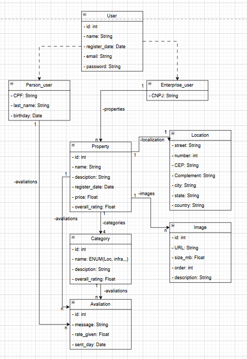

# 🏢 Glassroof Imobiliário

> Um sistema de avaliações transparente para o mercado imobiliário. Saiba o que as pessoas falaram sobre seu próximo lar antes de assinar o contrato.

## 📖 Sobre o Projeto

O **Glassroof Imobiliário** é uma plataforma colaborativa focada no mercado de imóveis. O sistema permite que imobiliárias cadastrem seus portfólios, enquanto usuários podem avaliar e comentar sobre categorias específicas, como **vizinhança**, **localização**, **infraestrutura do prédio** e **segurança**. 

O objetivo é democratizar o acesso à informação real sobre os imóveis, ajudando futuros moradores a tomarem decisões mais seguras e embasadas.

## 🚀 Tecnologias Utilizadas (Stack)

O projeto foi desenvolvido utilizando uma arquitetura moderna baseada em componentes no Front-end e uma RESTful API orientada a serviços no Back-end.

**Front-end:**
* **React.js**: Biblioteca principal para construção da interface.
* **React Router**: Gerenciamento de rotas e navegação SPA (Single Page Application).

**Back-end:**
* **Python**: Linguagem principal.
* **Flask**: Microframework web para a construção da API.
* **SQLAlchemy**: ORM para comunicação fluida com o banco de dados.
* **Pytest / Unittest**: Framework para garantia de qualidade através de testes unitários.

**Banco de Dados:**
* **MySQL**: Banco de dados relacional.

## 📂 Arquitetura e Disposição de Pastas

O repositório está dividido em duas aplicações principais (Monorepo). O back-end utiliza uma arquitetura em camadas (`Routes` -> `Services` -> `Models`), garantindo o isolamento da regra de negócio e facilitando a cobertura de testes.

```text
glassroof-imobiliario/
├── backend/                  # API Flask
│   ├── app/
│   │   ├── __init__.py       # Factory da aplicação Flask
│   │   ├── config.py         # Variáveis de ambiente e configs do BD
│   │   ├── models/           # Modelos do SQLAlchemy (User, Property, Review)
│   │   ├── routes/           # Endpoints (camada de transporte HTTP)
│   │   └── services/         # Regras de negócio puras (isoladas para facilitar testes)
│   ├── tests/                # Suíte de testes unitários e de integração
│   │   ├── test_services/    # Testes das regras de negócio
│   │   └── test_routes/      # Testes dos endpoints da API
│   ├── requirements.txt      # Dependências do Python
│   └── run.py                # Ponto de entrada para rodar o servidor
│
├── frontend/                 # Aplicação React
│   ├── public/               # Arquivos estáticos
│   ├── src/
│   │   ├── assets/           # Imagens e ícones
│   │   ├── components/       # Componentes de UI reutilizáveis
│   │   ├── pages/            # Páginas mapeadas nas rotas
│   │   ├── routes/           # Configuração do React Router
│   │   ├── services/         # Integração com a API Flask (ex: chamadas Axios)
│   │   ├── App.jsx           # Componente raiz
│   │   └── main.jsx          # Ponto de montagem do React
│   └── package.json          # Dependências do Node/React
│
└── README.md                 # Documentação do projeto
```

## Diagrama de Classes
**User**: Usuário da aplicação, que pode ser pessoa ou empresa.

**Property**: Imóvel cadastrado na plataforma, com atributos como endereço e descrição.

**Category**: Categoria de avaliação (vizinhança, localização, etc.).

**Review**: Avaliação feita por um usuário sobre um imóvel, associada a uma categoria específica. Ou então uma avaliação geral do imóvel.

**Location**: Localização do imóvel, com atributos como rua e número.

**Image**: Imagens associadas a um imóvel, com atributos como URL e descrição.



## ▶️ Como dar Run a Aplicação
### Back-end (Flask API)
1. Navegue até a pasta `backend`:
   ```bash
   cd backend
   ```
2. Crie um ambiente virtual e ative-o:
   ```bash
    python -m venv venv
    source venv/bin/activate  # Linux/Mac
    venv\Scripts\activate     # Windows
    ```
3. Instale as dependências:
   ```bash
   pip install -r requirements.txt
   ```
4. Execute o servidor:
    ```bash
    python run.py
    ```
### Front-end (React)
1. Navegue até a pasta `frontend`:
   ```bash
   cd frontend
   ```
2. Instale as dependências:
   ```bash
    npm install
    ```
3. Inicie a aplicação:
   ```bash
    npm start
    ```
